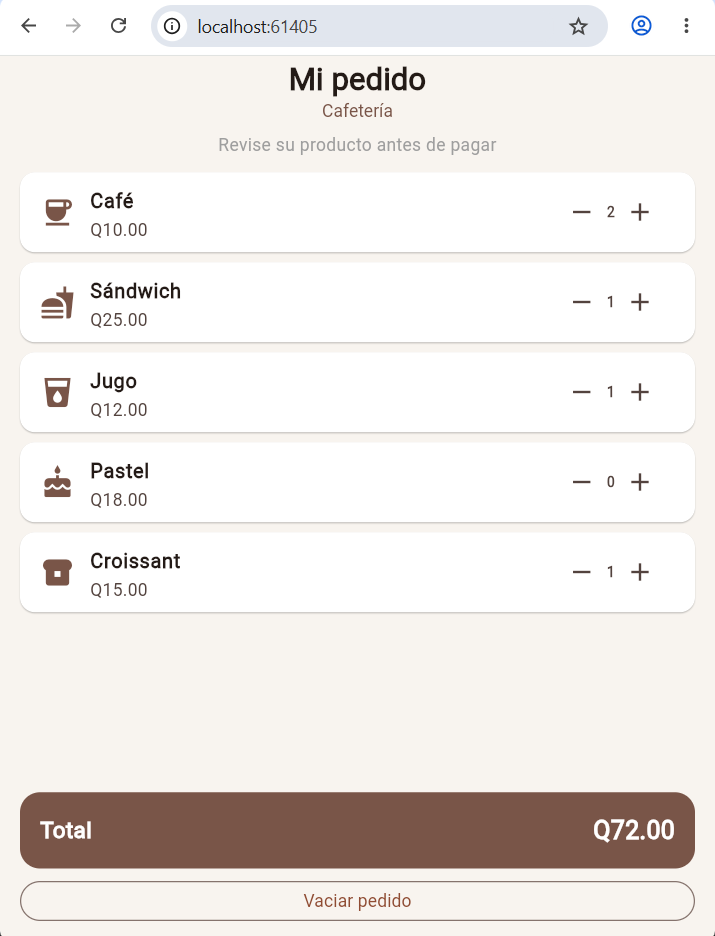

# Mi pedido de cafetería

Aplicación Flutter para gestionar un pedido de cafetería.

## Productos

- Café — Q10.00
- Sándwich — Q25.00
- Jugo — Q12.00
- Pastel — Q18.00
- Croissant — Q15.00

## Funcionalidades

- Aumentar y disminuir la cantidad de cada producto.
- Las cantidades no pueden ser menores que 0.
- Cálculo automático del total.
- Botón para vaciar el pedido.
- Uso del widget reutilizable `ProductoPedido`.

## ¿Cómo calcula el total?

El total se obtiene multiplicando el precio de cada producto por su cantidad y sumando los resultados.

Por ejemplo:

2 cafés + 1 sándwich + 1 jugo

(2 × Q10.00) + (1 × Q25.00) + (1 × Q12.00)

**Total: Q57.00**

## ¿Por qué conviene reutilizar ProductoPedido?

Porque permite utilizar la misma estructura para todos los productos sin repetir el código de la interfaz. Cada producto recibe sus propios datos, como nombre, precio, icono y cantidad.

## Imagen de visualizacion

