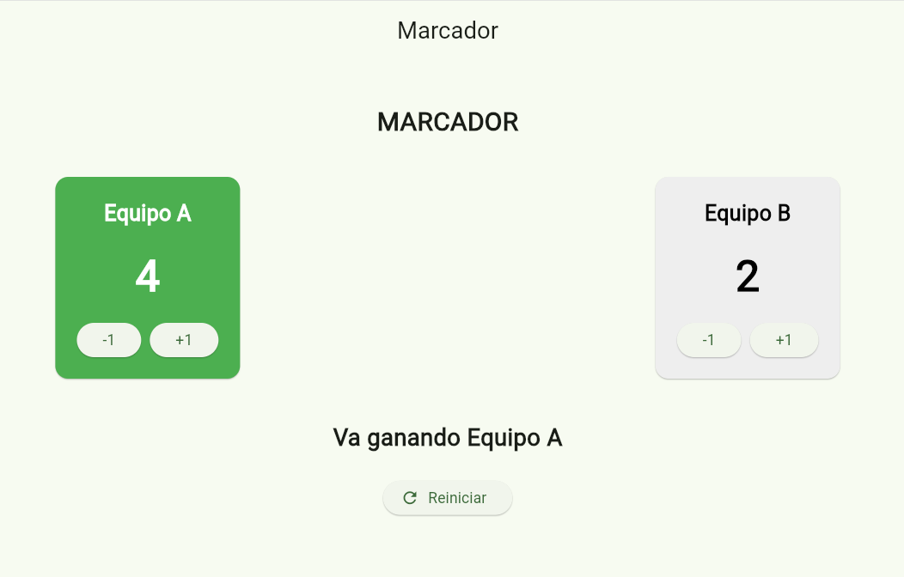
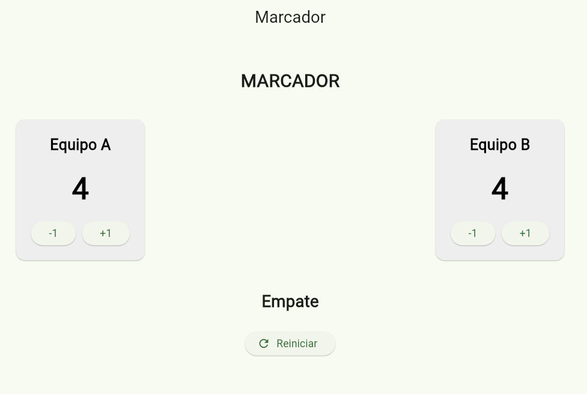

# marcador
# Laboratorio: Marcador

## Descripción

Aplicación desarrollada en Flutter para llevar el marcador de dos equipos. Cada equipo inicia con 0 puntos y cuenta con botones para aumentar o disminuir su puntuación. La aplicación evita que los puntos sean menores que cero.

También se muestra el estado actual del marcador mediante los mensajes **"Empate"** o **"Va ganando Equipo A/B"**. El equipo que lleva la ventaja se resalta visualmente en color verde, mientras que en caso de empate ambos equipos mantienen un estilo neutral.

## Uso de StatefulWidget y setState

Los puntos de ambos equipos se almacenan como variables dentro del `State` del `StatefulWidget`. Al presionar los botones `+1`, `-1` o `Reiniciar`, se utiliza `setState()` para modificar los valores y actualizar automáticamente la interfaz.

Si los puntos se modificaran sin utilizar `setState()`, el valor de la variable podría cambiar internamente, pero Flutter no reconstruiría la interfaz en ese momento, por lo que el marcador mostrado en pantalla no se actualizaría correctamente.

## Documentación consultada

Para realizar la interfaz se revisó la documentación oficial de Flutter, especialmente la documentación relacionada con `StatefulWidget`, `setState`, `Row`, `Column`, `Card`, `Text` y los botones utilizados en la aplicación.

## Capturas de pantalla

### Equipo ganando

### Empate

A new Flutter project.

## Getting Started

This project is a starting point for a Flutter application.

A few resources to get you started if this is your first Flutter project:

- [Learn Flutter](https://docs.flutter.dev/get-started/learn-flutter)
- [Write your first Flutter app](https://docs.flutter.dev/get-started/codelab)
- [Flutter learning resources](https://docs.flutter.dev/reference/learning-resources)

For help getting started with Flutter development, view the
[online documentation](https://docs.flutter.dev/), which offers tutorials,
samples, guidance on mobile development, and a full API reference.
